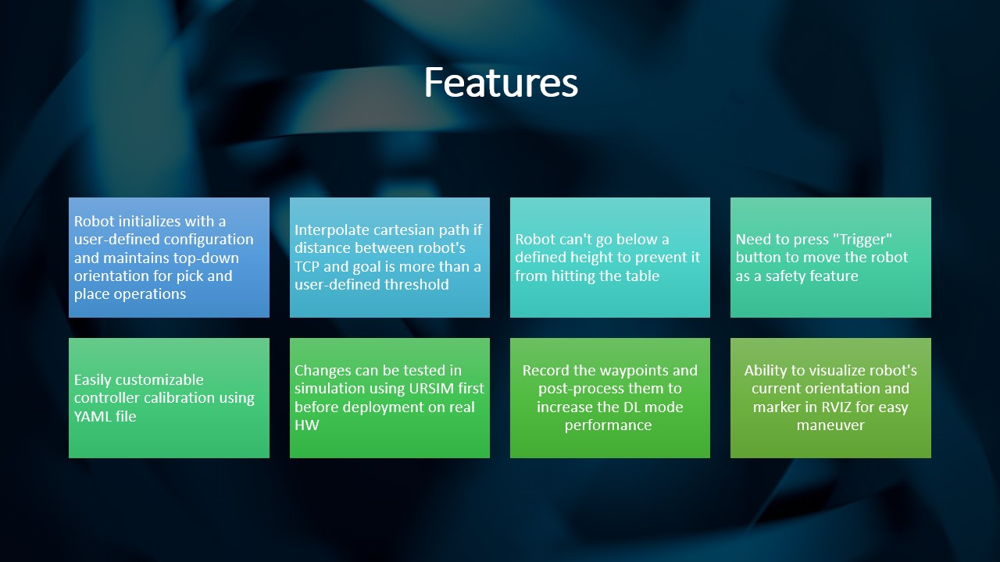
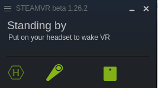
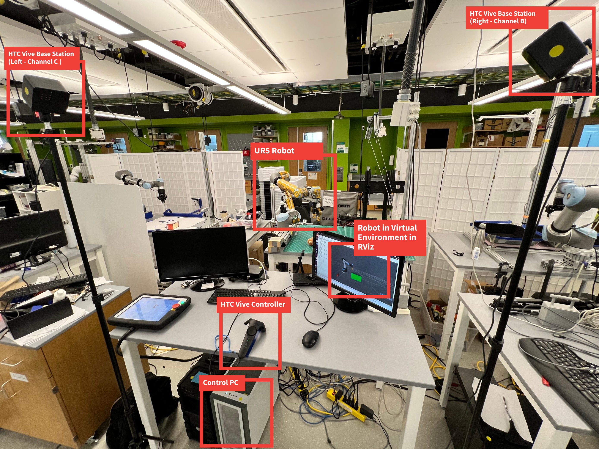
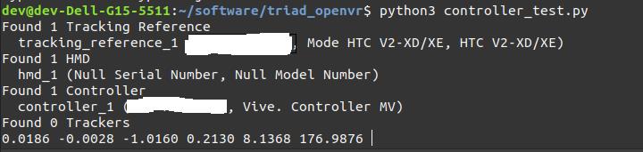
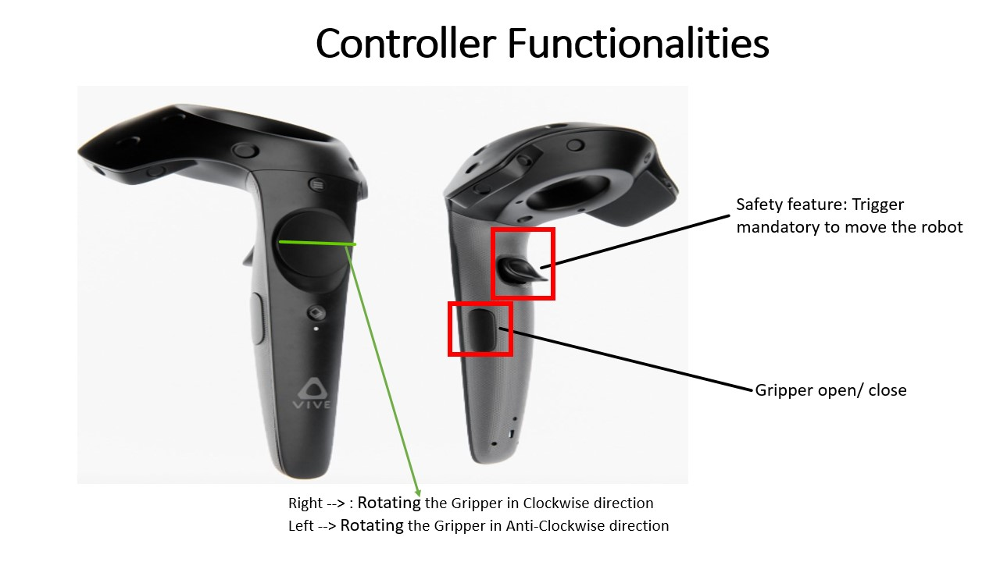

# UR5_VR_teleop

Control a UR5 robot using HTC Vive controller.

## Features

## Installation and Execution Guidance

Before using this package, make sure you have the following prerequisites installed:

- Ubuntu 20.04 & ROS Noetic

Follow these steps for installation:

1. Install URSIM by following the instructions provided in [URSim Installation Guide](https://github.com/githubuser0xFFFF/URSim_Install_Guides/tree/lubuntu-2004-ursim-5.12.2). You may ignore the `net-statistics` part. Just installing deb packages should be good enough

2. Install the Steam app for Ubuntu (https://linuxhint.com/install-steamos-on-ubuntu/ )

3. Install the Beta Version of SteamVR on the Steam app (https://www.vive.com/us/support/vive/category_howto/optin-to-steamvr-beta.html)

4. Change the null driver related settings so that you can use the HTC Vive Controller without headset:
    - Navigate to hidden files in your home directory and go to `.steam`. Easiest way to do so it to enable the `Show Hidden Files` features in the Nautilus file manager 
    - Find `default.vrsettings`, open it and make the following changes under `"steamvr"`:
        - `"requireHmd": false`
        - `"forcedDriver": "null"`
        - `"activateMultipleDrivers": true`
    - There should be one more `default.vrsettings` corresponding to `"driver_null"`, open it and enable the null driver by setting
        - `"enable": true`

5.  Git clone this repo and build the catkin workspace
    - `cd ~/Documents/`
    - `mkdir ur5_teleop_ws && cd ur5_teleop_ws/`
    - `mkdir src && cd src/`
    - `git clone https://github.com/devvaibhav455/UR5_VR_teleop.git .`
    - `cd .. &&  catkin_make`
    - `source ~/Documents/ur5_teleop_ws/devel/setup.bash`

## Setting Up Base Stations and Controllers

1. Set up Base Stations - Left (Channel C) and Right (Channel B), ensuring they are pointing 30 degrees down towards the floor and facing the Vive controller. Maintain a minimum distance of ~50cm between the base stations and the Vive controller. Otherwise, the Base stations might not track the controller.

2. In the Steam VR app, you should see that 2 base stations and a controller are connected, indicated by their respective symbols.

One square icon indicating that one base station is detected. When two are connected, two square icons should light up.

If everything is working fine, the controller icon should not blink and two square icons (one for each base station) should light up.

*You may take this image as a reference*

## How to quickly test if the controller is being tracked by the base stations or not?

1. `cd triad_openvr`
2. `python3 controller_test.py` 

It should show 6 DOF pose information in real time.

## Calibration

For calibration, open `ur5_teleop_vive/src/cfgs/teleop.yaml`. This file contains the position/calibration settings for an environment, which can be adjusted. Use Rviz for calibration tasks.

The HTC Vive Controller publishes the 6DOF pose but it might appear very far away from the robot in rviz. To overcome this, rotational and translational offsets are applied. You may adjust these values and see which set of numbers work for you. Try setting some values, stop and re-run `vive_ur5_teleop.py` to see the change in RViz until you see the marker's position close to the robot.

## How to Run the System?

1. Start ROS core: `roscore`

2. Disable simulation time: `rosparam set use_sim_time false`

### Follow these steps for Real robot's Testing only

3. Open SteamVR (if it updates, cancel it otherwise need to change the vrsettings file again). If you figure out a way to prevent it from updating, please let me know as well!

4. Source your workspace: `source ~/Documents/ur5_teleop_ws/devel/setup.bash`

5. Launch the HTC Vive teleop package: `roslaunch htc_vive_teleop_stuff vive_tf_joy_and_ps.launch`

6. Launch the UR5 robot package: `roslaunch ur5_teleop_vive ur5_bringup.launch`
It should open gazebo (ignore the robot's condition, it won't update) and RViz

### Follow these steps for Simulation Testing only

7. Start the UR5 simulation (URSIM): `/opt/ursim/5.12.2/start-ursim.sh UR5`

8. If you want to test using a virtual joystick, run: `rosrun rqt_virtual_joy rqt_virtual_joy`

9. Run the provided scripts for simulation testing:
   - `cd ~/Documents/ur5_teleop_ws/src/ur5_teleop_vive/src/vive_sim_test`
   - `python3 dummy_static_tf_pub.py`
   - `cd ~/Documents/ur5_teleop_ws/src/htc_vive_teleop_stuff/scripts/`
   - `python3 frame_as_posestamped.py right_controller hmd 30`

These steps perform the same job as that of `vive_tf_joy_and_ps.launch` but by simulation the controller and following a trajectory defined in `dummy_static_tf_pub.py`

### Follow these steps for for Simulation/ Real Testing both

10. Run the UR5 teleop script: `cd ~/Documents/ur5_teleop_ws/src/ur5_teleop_vive/src/ && python3 vive_ur5_teleop.py` It will publish the HTC Vive controller's position to see in RViz.

11. Ensure proper permissions for the gripper USB `/dev/ttyUSB0`: `sudo chmod 777 /dev/ttyUSB0` or you may chown as well

12. Install the required Python package: `pip3 install pymodbus==2.1.0`

13. Run the Robotiq gripper control node:
    - `roscd robotiq_c_model_control/nodes/`
    - `python3 CModelRtuNode.py /dev/ttyUSB0`

Gripper's light should change to Blue.

14. For recording data, use `rosbag record` with the `/ee_pose` topic.

## Move the robot

15. `source ~/Documents/ur5_teleop_ws/devel/setup.bash`

16. `cd ~/Documents/ur5_teleop_ws/src/ur5_teleop_vive/src/`

17. Remember to change your robot's IP in the script before running it
    - `python3 ur_follow_using_class.py`

The code is self explainable. However, if you still need any help. Please feel free to raise a question/ bug on Github and I will try my best to respond it ASAP.

*Button configuration to control the robot*

## Postprocessing Data (might need some work)

To analyze data, run the `2cm_gap.py` script, which prints data after every 2 cm of travel from the current pose to the goal pose. The script is located in `~/UR5_VR_teleop/src/ur5_teleop_vive/src`.

## Debug tips

Sometimes, RTDE connection is not closed successfully if CTRL+C is pressed for `ur_follow_using_class.py`. In that case, you might want to run `close_robot.py`, try to emergency stop the robot/ reboot it using the teach pendant, and re-running `ur_follow_using_class.py`

## Authors
- [Dev Vaibhav](https://github.com/devvaibhav455)
- [Siddharth Maheshwari](https://github.com/Sid0225)

## References
- https://www.roadtovr.com/how-to-use-the-htc-vive-tracker-without-a-vive-headset/
- https://github.com/uts-magic-lab/htc_vive_teleop_stuff
- https://github.com/ros-industrial/robotiq
- https://github.com/ros-industrial/universal_robot

